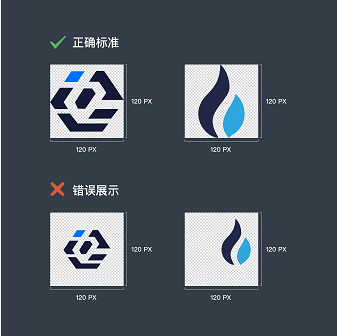

## 代币提交教程

### 要求

Logo 设计要求

* 尺寸: 120x120 像素
* 图片为透明背景的 PNG 格式
* 品牌标识水平竖直居中顶边
  如图：  
  

## 开始提交代币
###### 建议由技术人员协助完成
```
Fork 这个仓库到你的账户,克隆到本地
注意：不是直接克隆最原始的仓库，而是克隆你 fork 的那个仓库
git clone git@github.com:xxxxxxxx/Owncoin-Profile.git

cd tokens/
创建并且切换到用你的 token symbol 命名的分支里 举例：
git branch xxx-token
git checkout xxx-token
```

在 Owncoin-Profile/tokens/目录下选择所属链，如eth, 在里面添加一个新的 json 文件，使用你的代币合约地址命名这个文件，举例：   
```
（0xf90f1648926005A8bb3ed8ec883164De7F768743.json）  
```
json 文件请使用 UTF-8 编码，内容请参照模版文件补充完整的代币资料：
[内容模版](tokens/token.json)

代币 Logo 可使用远程下载地址, 也可放到 images 目录里，图片名称使用代币合约地址命名，如：
```
0xf90f1648926005A8bb3ed8ec883164De7F768743.png
```

Commit 并且 Push 提交信息到你的仓库 举例：
```
git add -A
git commit -m “Add xxx token”
git push origin xxx-token
```
在你的仓库页面下点击 New pull request 按钮 ，并附上项目资料，包括但不限于以下：  
- 团队背景：
- 项目基本情况：
- 收录的交易所：
- 代币转账调用智能合约需要的 Gas limit（默认值 60000）  

##### 我们会尽快核实你的 PR，如果 PR 没问题我们会合并到主分支下，至此你的代币资料将会出现在 Owncoin App 内
